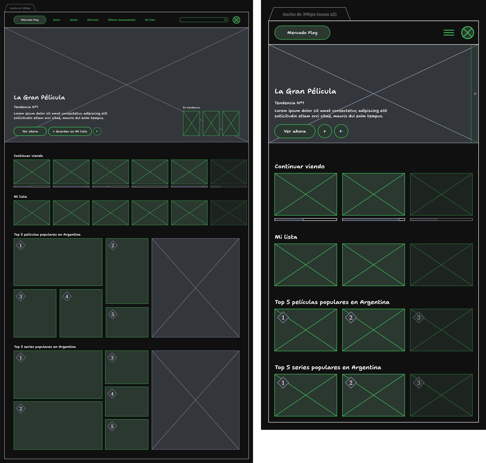
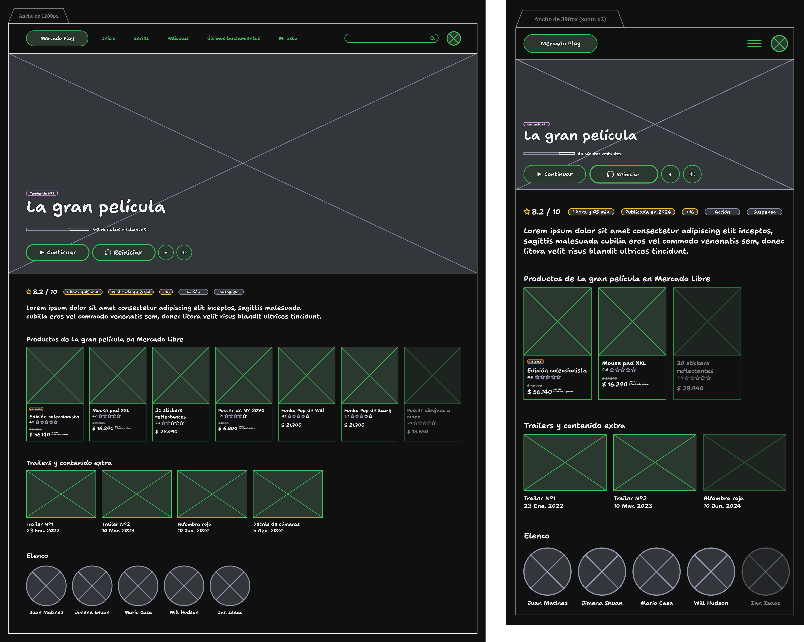
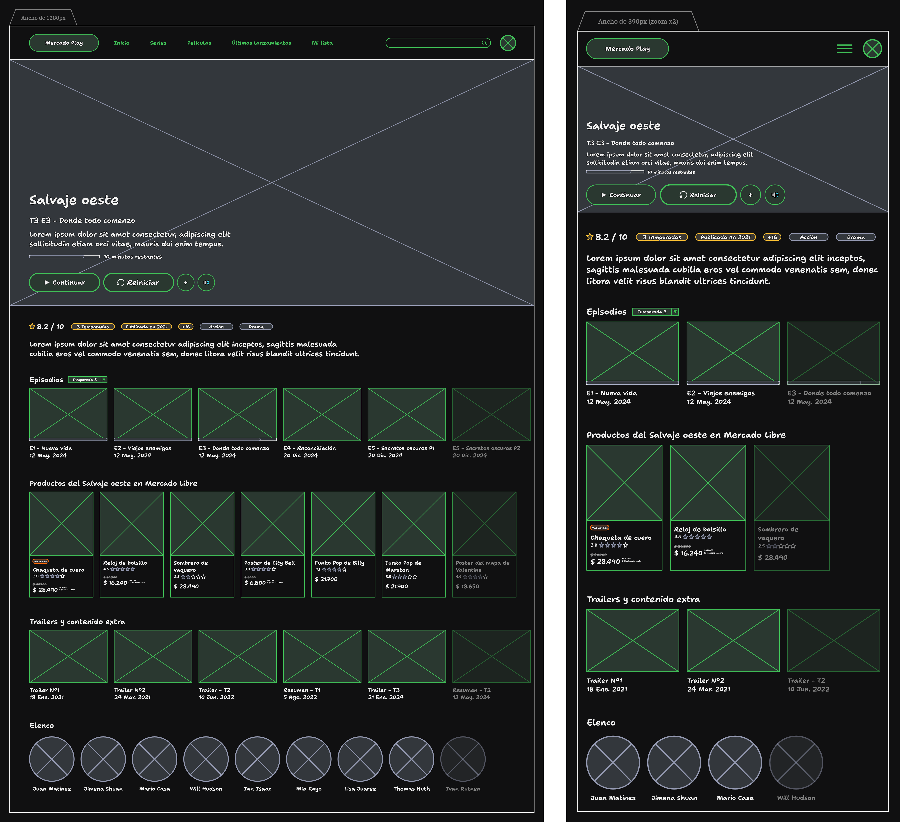

<h1 align="center">
    Mercado Play [ WIP ]
</h1>

    <strong>Redesign of <a href="https://play.mercadolibre.com.ar/">Mercado Play</a> developed with <a href="https://astro.build/">Astro</a>.</strong>

    <a href="#summary">Summary</a> •
    <a href="#key-features">Key features</a> •
    <a href="#design-process">Design process</a> •
    <a href="#manual-installation">Manual installation</a> •
    <a href="#license">License</a> •
    <a href="#contact">Contact</a>

    <a href="./docs/translations/es/README.md">[ Spanish version ]</a>

    <a href="#"> <!-- TODO -->
         <!-- TODO -->
    </a>

    (test the <a href="#">live redesign</a> or watch the <a href="#">demo video</a>) <!-- TODO -->

## Summary

[Mercado Play redesign](#) to address the deficiencies in the user experience (UX) of the current design.

> [Mercado Play](https://play.mercadolibre.com.ar/) is a free streaming service for films and series developed by [Mercado Libre](https://news.mercadolibre.com/). <!-- TODO -->

### Why did I redesign Mercado Play?

The current [Mercado Play](https://play.mercadolibre.com.ar/) design isn't optimal and has many aspects to improve. For example, it shouldn't be inside the [Mercado Libre ECommerce platform](https://mercadolibre.com/) as there is no clear connection for a user to access an ECommerce platform just to watch a film or series, resulting in poor user experience (UX). However, it could be related to the ECommerce platform in ways that improve the UX by connecting films/series to merchandising or related products. That's why I redesigned it.

## Key features

- [ TODO ].

## Design process

### Find the problems

First, I started identifying the major UX problems that [Mercado Play](https://play.mercadolibre.com.ar/) has:

1. It looks like the [Mercado Libre ECommerce platform](https://mercadolibre.com/), so users perceive it as an ECommerce extension and not a streaming service within the [Mercado Libre ecosystem](https://www.mercadolibre.com.ar/institucional/somos/ecosistema-mercado-libre). Additionally, as it does not follow typical UX designs of streaming services, users often get lost navigating its interface.
2. Ads on streamed content are too invasive. Nowadays, excessive ads frustrate users to the point that they abandon the application after encountering multiple ads during their first attempt to use it.
3. As there is no mobile or TV application, many users cannot enjoy the service with their families.

### Get the solutions

After identifying these problems, I thought about how they could be solved:

Too similar to the ECommerce platform

Since the current [Mercado Play](https://play.mercadolibre.com.ar/) design closely resembles [Mercado Libre ECommerce platform](https://mercadolibre.com/), it feels unfamiliar to users who consume streaming services. So, how should its interface be redesigned?

To align with the common UX of streaming services, it should have a familiar layout (navigation bar, carousels for films/series, iconography, etc.) while maintaining key differences to make it recognizable. The design team should study the UX patterns of streaming services like [Netflix](https://www.netflix.com/), [Disney+](https://www.disneyplus.com/), [Amazon Prime Video](https://www.primevideo.com/), [Paramount+](https://www.paramountplus.com/), and others, integrating new trends into the [Mercado Play](https://play.mercadolibre.com.ar/) design to create a unique yet intuitive UX.

> [!TIP]
> Check out the [low-fidelity UI](#design-the-low-fidelity-ui) to see how I planned the component layout.

Invasive ads

Ads help monetize the service to keep it free, but the current implementation on [Mercado Play](https://play.mercadolibre.com.ar/) harms the user experience (UX). So, how can [Mercado Play](https://play.mercadolibre.com.ar/) be monetized without invasive ads? One solution is to use [Mercado Ads](https://ads.mercadolibre.com.ar/productAds)[^1] campaigns.

The company could introduce a tool allowing publishers to display ads after a film/series ends, encouraging users to buy products related to what they've watched. Publishers could also display ads at the beginning of each film/series, or [Mercado Libre ECommerce](https://mercadolibre.com/) could promote its special offer events (like [Hot Sale](https://www.mercadolibre.com.ar/hot-sale), [Cyber Monday](https://www.mercadolibre.com.ar/cyber-monday), or [Black Friday](https://www.mercadolibre.com.ar/black-friday)) to broaden their reach.

For users with [Level 6](https://www.mercadolibre.com.ar/suscripciones/nivel-6) subscriptions on the ECommerce platform, the company could provide access to [Mercado Play](https://play.mercadolibre.com.ar/) with minimal ads only after a film/series ends.

Finally, [Mercado Libre](https://news.mercadolibre.com/) could encourage users to engage with [Mercado Play](https://play.mercadolibre.com.ar/) by offering discounts on related products upon completing a film/series, fostering loyalty and connecting the ECommerce and streaming services.

> [!TIP]
> When I refer to _"series ends"_, I mean when all episodes of the serie ends and not at the end of each episode. Similarly, _"ads"_ refers to those integrated seamlessly into the interface without disrupting the UX.

No mobile or TV application

Developing native mobile and TV apps requires significant investment in resources. So, how could [Mercado Libre](https://news.mercadolibre.com/) create a native application for [Mercado Play](https://play.mercadolibre.com.ar/) without incurring excessive costs?

As the company uses [React](https://es.react.dev/) and likely has many developers familiar with this technology, some teams could be reoriented to [React Native](https://reactnative.dev/) to develop a cross-platform application for mobile and TV. This approach minimizes costs, leveraging existing knowledge of [React](https://es.react.dev/) since [React Native](https://reactnative.dev/) has a similar syntax and workflow.

<!-- prettier-ignore-start -->
> [!WARNING]
> While [React Native](https://reactnative.dev/) supports platforms like iOS, Android, and TVs, it has limitations compared to fully native environments.
<!-- prettier-ignore-end -->

### Design the low-fidelity UI

Since the current UX of [Mercado Play](https://play.mercadolibre.com.ar/) has issues, I redesigned its component layout, creating a low-fidelity UI for web and mobile designs.

> [!TIP]
> Components with a green background are interactive.

#### Home

<picture>
  <source srcset="./docs/statics/low-fidelity-ui-home__light.png" media="(prefers-color-scheme: light)" />
  
</picture>

#### Film information

<picture>
  <source srcset="./docs/statics/low-fidelity-ui-film__light.png" media="(prefers-color-scheme: light)" />
  
</picture>

#### Serie information

<picture>
  <source srcset="./docs/statics/low-fidelity-ui-serie__light.png" media="(prefers-color-scheme: light)" />
  
</picture>

### Develop the design

I chose [Astro](https://astro.build/) as the web framework to develop the [Mercado Play redesign](#) because it is well-suited for creating new concepts for existing applications. As this is not a production-ready application, Astro provides more than enough tools. But what about the styles? I opted for the [Justd](https://getjustd.com/) components library because it offers a collection of accessible, functional, and minimalist-styled components built with [Tailwind CSS](https://tailwindcss.com/). <!-- TODO -->

Finally, after completing each step of the design process, it was successfully developed and hosted. You can access to the new [Mercado Play](https://play.mercadolibre.com.ar/) design at https://localhost:3000/. <!-- TODO -->

## Manual installation

1. Clone the repository by downloading it into your machine.
2. Install [Node.js](https://nodejs.org/) (runtime environment) and [pnpm](https://pnpm.io/).
3. Open the downloaded repository in [Visual Studio Code](https://code.visualstudio.com/) (code editor).
4. Run `pnpm install` to install all the necessary packages.
5. Run `pnpm run dev` or `pnpm run dev:host` to run the [Mercado Play redesign](#) on your machine. <!-- TODO -->

> [!WARNING]
> Follow these instructions only if you want to run the [Mercado Play redesign](#) locally. If you'd rather just see it in action, visit https://localhost:3000/. <!-- TODO -->

## License

This repository is under [MIT License](./LICENSE), if you want to see what you are allowed to do with the content of this repository, please visit [choosealicense](https://choosealicense.com/licenses/) for more information.

## Contact

If you want to contact me, please see my [socials medias](https://github.com/hozlucas28) in my GitHub profile.

[^1]: Dedicated service to publish ads in the [Mercado Libre ecosystem](https://www.mercadolibre.com.ar/institucional/somos/ecosistema-mercado-libre).
