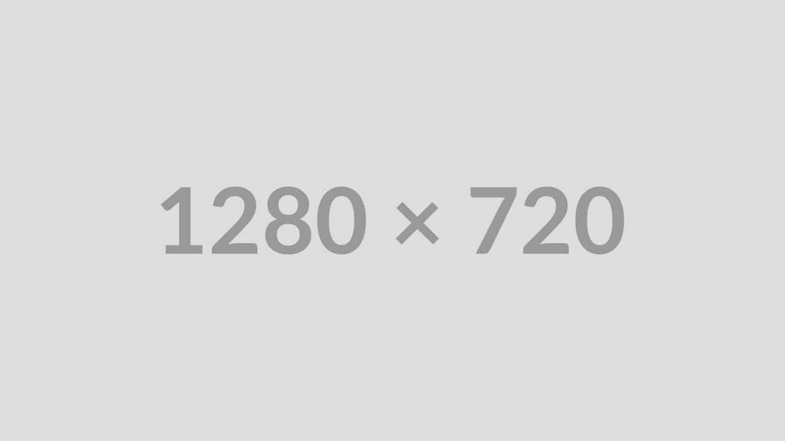
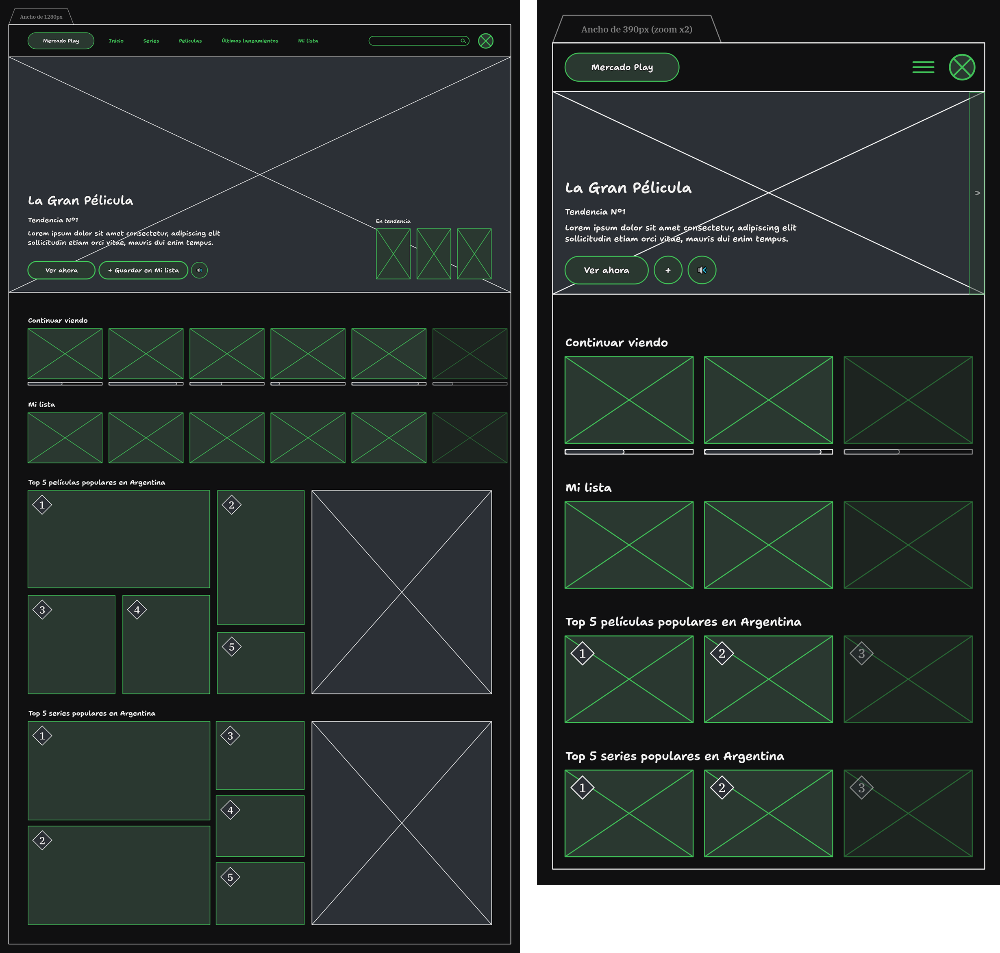

<h1 align="center">
    Mercado Play [ WIP ]
</h1>

    <strong>Rediseño de <a href="https://play.mercadolibre.com.ar/">Mercado Play</a> desarrollado con <a href="https://astro.build/">Astro</a>.</strong>

    <a href="#resumen">Resumen</a> •
    <a href="#características-clave">Características clave</a> •
    <a href="#proceso-de-diseño">Proceso de diseño</a> •
    <a href="#instalación-manual">Instalación manual</a> •
    <a href="#licencia">Licencia</a> •
    <a href="#contacto">Contacto</a>

    <a href="../../../README.md">[ Versión en inglés ]</a>

    <a href="#"> <!-- TODO -->
         <!-- TODO -->
    </a>

    (prueba el <a href="#">rediseño en vivo</a> o ve el <a href="#">video demostrativo</a>) <!-- TODO -->

## Resumen

[Rediseño de Mercado Play](#) para resolver las deficiencias en la experiencia de usuario (UX) del diseño actual.

> [Mercado Play](https://play.mercadolibre.com.ar/) es un servicio de streaming gratuito de películas y series desarrollado por [Mercado Libre](https://news.mercadolibre.com/). <!-- TODO -->

### ¿Por qué rediseñé Mercado Play?

El diseño actual de [Mercado Play](https://play.mercadolibre.com.ar/) no es óptimo y tiene muchos aspectos que mejorar. Por ejemplo, no debería estar dentro de la [plataforma de ECommerce de Mercado Libre](https://mercadolibre.com/), ya que no existe una conexión clara para que un usuario acceda a una plataforma de ECommerce solo para ver una película o serie, lo que resulta en una mala experiencia de usuario (UX). Sin embargo, podría estar relacionado con la plataforma de ECommerce de formas que mejoren la UX al conectar películas/series con merchandising o productos relacionados. Por eso lo rediseñé.

## Características clave

- [ TODO ].

## Proceso de diseño

### Identificar los problemas

Primero, comencé identificando los principales problemas de UX que tiene [Mercado Play](https://play.mercadolibre.com.ar/):

1. Se parece a la [plataforma de ECommerce de Mercado Libre](https://mercadolibre.com/), por lo que los usuarios lo perciben como una extensión de ECommerce y no como un servicio de streaming dentro del [ecosistema de Mercado Libre](https://www.mercadolibre.com.ar/institucional/somos/ecosistema-mercado-libre). Además, al no seguir diseños típicos de UX de servicios de streaming, los usuarios a menudo se pierden navegando por su interfaz.
2. Los anuncios en el contenido transmitido son demasiado invasivos. Hoy en día, los anuncios excesivos frustran a los usuarios hasta el punto de abandonar la aplicación tras encontrarse con múltiples anuncios en su primer intento de uso.
3. Al no haber una aplicación mobile o para TV, muchos usuarios no pueden disfrutar del servicio con sus familias.

### Encontrar las soluciones

Después de identificar estos problemas, pensé en cómo podrían resolverse:

Demasiado similar a la plataforma de ECommerce

Dado que el diseño actual de [Mercado Play](https://play.mercadolibre.com.ar/) se parece mucho a la [plataforma de ECommerce de Mercado Libre](https://mercadolibre.com/), se siente desconocido para los usuarios que consumen servicios de streaming. Entonces, ¿cómo debería rediseñarse su interfaz?

Para alinearse con la UX común de los servicios de streaming, debería tener un diseño familiar (barra de navegación, carruseles para películas/series, iconografía, etc.) mientras mantiene diferencias clave para hacerlo reconocible. El equipo de diseño debería estudiar los patrones de UX de servicios de streaming como [Netflix](https://www.netflix.com/), [Disney+](https://www.disneyplus.com/), [Amazon Prime Video](https://www.primevideo.com/), [Paramount+](https://www.paramountplus.com/) y otros, integrando nuevas tendencias en el diseño de [Mercado Play](https://play.mercadolibre.com.ar/) para crear una UX única pero intuitiva.

> [!TIP]
> Consulta la [interfaz de baja fidelidad](#diseñar-la-UI-de-baja-fidelidad) para ver cómo planeé la disposición de los componentes.

Anuncios invasivos

Los anuncios ayudan a monetizar el servicio para mantenerlo gratuito, pero la implementación actual en [Mercado Play](https://play.mercadolibre.com.ar/) perjudica la experiencia de usuario (UX). Entonces, ¿cómo puede [Mercado Play](https://play.mercadolibre.com.ar/) monetizarse sin anuncios invasivos? Una solución es utilizar campañas de [Mercado Ads](https://ads.mercadolibre.com.ar/productAds)[^1].

La empresa podría introducir una herramienta que permita a los anunciantes mostrar anuncios después de que termine una película/serie, animando a los usuarios a comprar productos relacionados con lo que han visto. También podrían mostrarse anuncios al inicio de cada película/serie, o [Mercado Libre ECommerce](https://mercadolibre.com/) podría promocionar sus eventos de ofertas especiales (como [Hot Sale](https://www.mercadolibre.com.ar/hot-sale), [Cyber Monday](https://www.mercadolibre.com.ar/cyber-monday) o [Black Friday](https://www.mercadolibre.com.ar/black-friday)) para ampliar su alcance.

Para los usuarios con suscripciones de [Nivel 6](https://www.mercadolibre.com.ar/suscripciones/nivel-6) en la plataforma de ECommerce, la empresa podría ofrecer acceso a [Mercado Play](https://play.mercadolibre.com.ar/) con anuncios mínimos solo al final de una película/serie.

Finalmente, [Mercado Libre](https://news.mercadolibre.com/) podría animar a los usuarios a interactuar con [Mercado Play](https://play.mercadolibre.com.ar/) ofreciendo descuentos en productos relacionados tras completar una película/serie, fomentando la lealtad y conectando los servicios de ECommerce y streaming.

> [!TIP]
> Cuando me refiero a _"termina la serie"_, quiero decir cuando se terminan todos los episodios de la serie y no al terminar cada episodio. Del mismo modo, los _"anuncios"_ se refieren a aquellos integrados sin interrupciones en la interfaz para no perjudicar la UX.

Sin aplicación mobile o para TV

Desarrollar aplicaciones nativas para mobile y TV requiere una inversión significativa en recursos. Entonces, ¿cómo podría [Mercado Libre](https://news.mercadolibre.com/) crear una aplicación nativa para [Mercado Play](https://play.mercadolibre.com.ar/) sin incurrir en costos excesivos?

Dado que la empresa utiliza [React](https://es.react.dev/) y probablemente tiene muchos desarrolladores familiarizados con esta tecnología, algunos equipos podrían orientarse a [React Native](https://reactnative.dev/) para desarrollar una aplicación multiplataforma para mobile y TV. Este enfoque minimiza costos aprovechando el conocimiento existente de [React](https://es.react.dev/), ya que [React Native](https://reactnative.dev/) tiene una sintaxis y un flujo de trabajo similar.

<!-- prettier-ignore-start -->
> [!WARNING]
> Aunque [React Native](https://reactnative.dev/) admite plataformas como iOS, Android y TVs, tiene limitaciones en comparación con los entornos totalmente nativos.
<!-- prettier-ignore-end -->

### Diseñar la UI de baja fidelidad

Dado que la UX actual de [Mercado Play](https://play.mercadolibre.com.ar/) tiene problemas, rediseñé la disposición de los componentes, creando una interfaz de baja fidelidad para web y mobile.

> [!TIP]
> Los componentes con fondo verde son interactivos..

#### Inicio

 <!-- TODO -->

#### Información de la película/serie

 <!-- TODO -->

### Desarrollar el diseño

Elegí [Astro](https://astro.build/) como el framework web para desarrollar el [rediseño de Mercado Play](#) porque es adecuado para crear nuevos conceptos de aplicaciones existentes. Dado que no es una aplicación lista para producción, Astro ofrece herramientas más que suficientes. ¿Pero qué hay de los estilos? Opté por la biblioteca de componentes [Justd](https://getjustd.com/), ya que ofrece una colección de componentes accesibles, funcionales y de estilo minimalista, construidos con [Tailwind CSS](https://tailwindcss.com/). <!-- TODO -->

Finalmente, después de completar cada paso del proceso de diseño, se lo logro desarrollar y hospedar. Puedes acceder al nuevo diseño de [Mercado Play](https://play.mercadolibre.com.ar/) en https://localhost:3000/. <!-- TODO -->

## Instalación manual

1. Clona el repositorio descargándolo en tu maquina.
2. Instala [Node.js](https://nodejs.org/) (entorno de ejecución) y [pnpm](https://pnpm.io/).
3. Abre el repositorio descargado en [Visual Studio Code](https://code.visualstudio.com/) (editor de código).
4. Ejecuta `pnpm install` para instalar todos los paquetes necesarios.
5. Ejecuta `pnpm run dev` o `pnpm run dev:host` para ejecutar el [rediseño de Mercado Play](#) en tu máquina. <!-- TODO -->

> [!WARNING]
> Sigue estas instrucciones solo si deseas ejecutar el [rediseño de Mercado Play](#) localmente. Si prefieres verlo en acción, visita https://localhost:3000/. <!-- TODO -->

## Licencia

Este repositorio está bajo la [Licencia MIT](./LICENSE). Si quieres saber qué puedes hacer con el contenido de este repositorio, visita [choosealicense](https://choosealicense.com/licenses/) para más información.

## Contacto

Si deseas contactarme, consulta mis [redes sociales](https://github.com/hozlucas28) en mi perfil de GitHub.

[^1]: Servicio dedicado a publicar anuncios en el [ecosistema de Mercado Libre](https://www.mercadolibre.com.ar/institucional/somos/ecosistema-mercado-libre).
